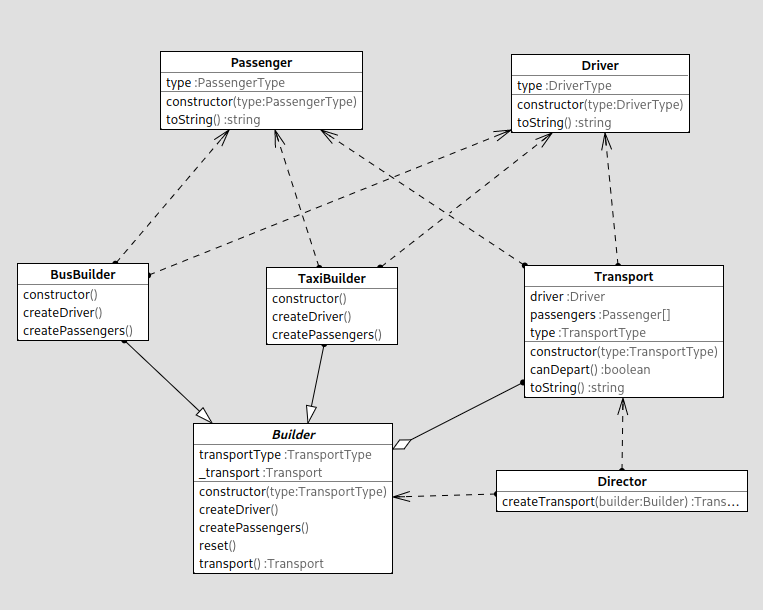

# Builder pattern

## Running the project

```bash
npm install && npx ts-node index.ts
```

## Example output

```
===============
Bus
Transport {
  passengers: [
    Passenger { type: 'adult' },
    Passenger { type: 'child' },
    Passenger { type: 'adult' },
    Passenger { type: 'discount' },
    Passenger { type: 'child' },
    Passenger { type: 'discount' },
    Passenger { type: 'child' },
    Passenger { type: 'adult' },
    Passenger { type: 'discount' },
    Passenger { type: 'child' },
    Passenger { type: 'child' },
    Passenger { type: 'discount' },
    Passenger { type: 'child' },
    Passenger { type: 'adult' },
    Passenger { type: 'adult' },
    Passenger { type: 'child' },
    Passenger { type: 'child' },
    Passenger { type: 'discount' },
    Passenger { type: 'adult' },
    Passenger { type: 'discount' },
    Passenger { type: 'discount' },
    Passenger { type: 'discount' },
    Passenger { type: 'adult' },
    Passenger { type: 'child' },
    Passenger { type: 'child' },
    Passenger { type: 'child' },
    Passenger { type: 'discount' },
    Passenger { type: 'child' },
    Passenger { type: 'adult' },
    Passenger { type: 'discount' }
  ],
  driver: Driver { type: 'bus' },
  type: 'bus'
}
Bus can depart? true
===============
Taxi
Transport {
  passengers: [
    Passenger { type: 'adult' },
    Passenger { type: 'discount' },
    Passenger { type: 'discount' },
    Passenger { type: 'adult' }
  ],
  driver: Driver { type: 'taxi' },
  type: 'taxi'
}
Taxi can depart? true
===============
```

## Class diagram


